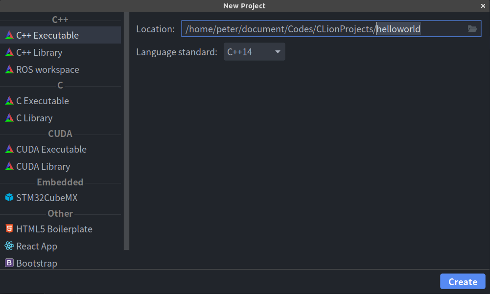
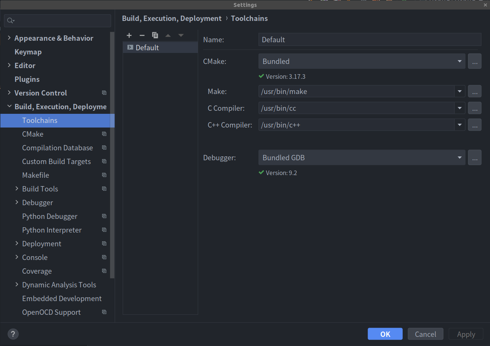
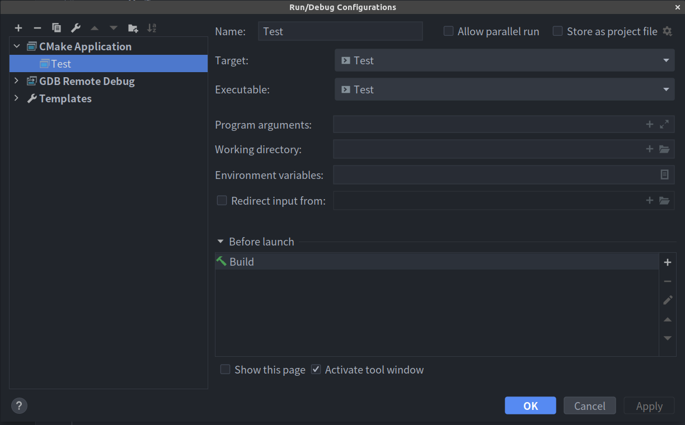
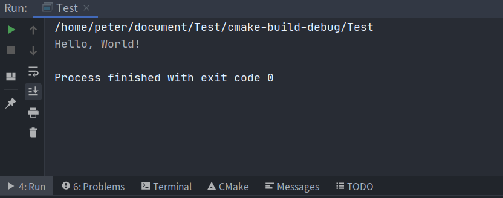
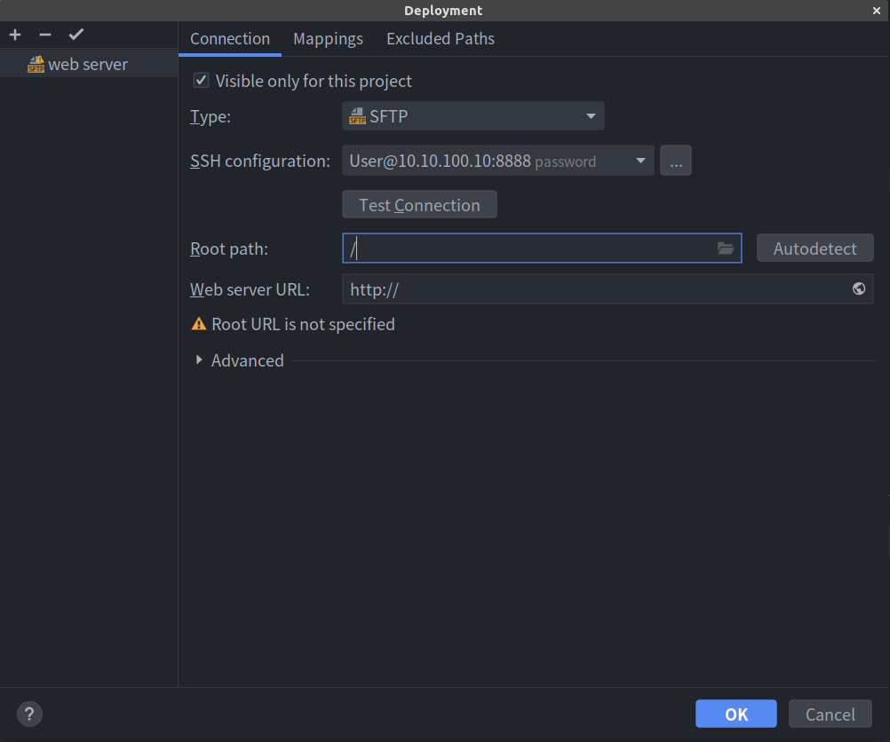
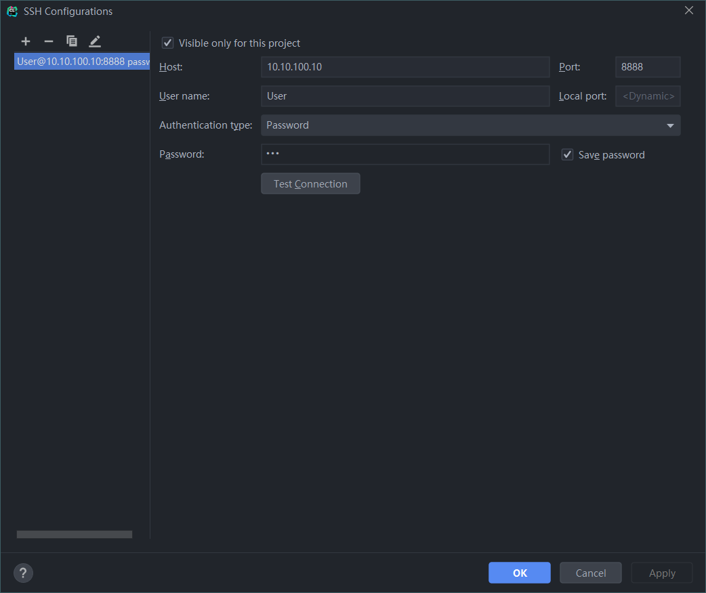
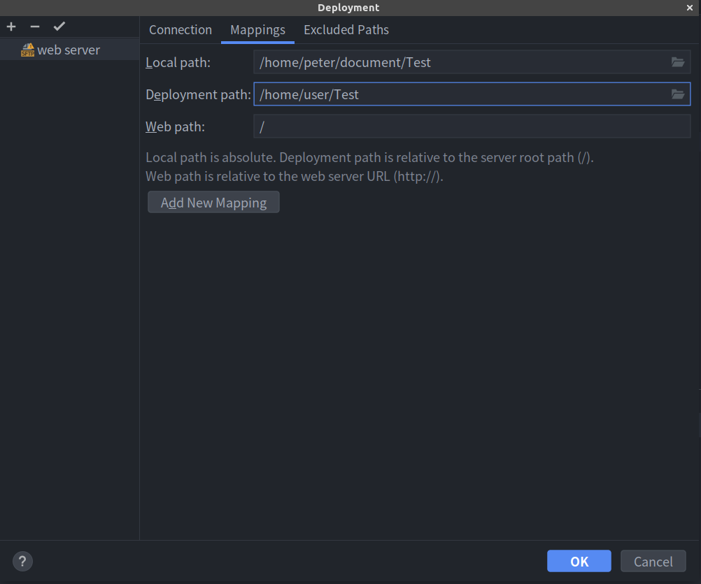
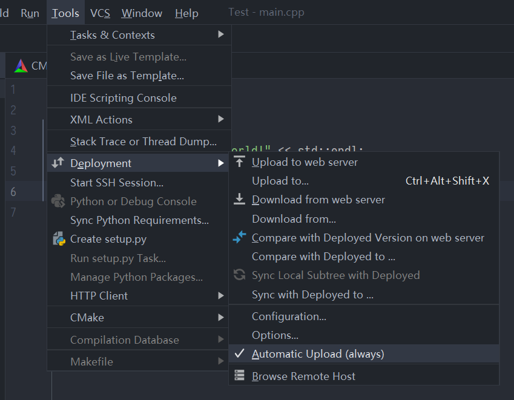
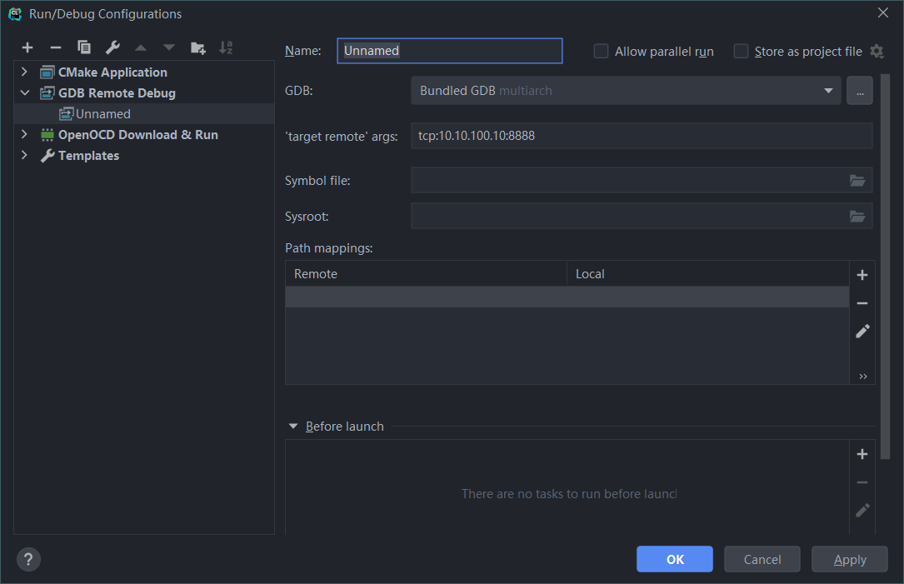

# IDE 配置

## 环境配置

1. 打开终端并执行下列命令:

```bash
sudo apt-get update
sudo apt-get install build-essential
sudo apt-get install cmake
sudo apt-get install bison
sudo apt-get install library*
sudo apt-get install libncurses5-dev
sudo apt-get install g++
sudo apt-get install kdelibs5-dev
sudo apt-get install make
```

## 安装 CLion

1. [下载安装包](https://www.jetbrains.com/clion/download/) **.tar.gz** 。

2. 解压下载好的 **CLion-*.tar.gz** 压缩包。 推荐的安装目录是 /opt: 

   ```bash
   sudo tar xvzf CLion-*.tar.gz -C /opt/
   ```

   > [!Warning]
   >
   > 为了避免冲突，不要在已有文件的目录下解压，应确保解压到一个空目录。

3. 运行在 **bin** 目录下的**CLion.sh** :

   ```bash
   sh /opt/clion-*/bin/clion.sh
   ```

   当第一次运行CLion时，需要一些步骤来完成安装、自定义实例和开始使用IDE。    

   更多相关信息, 可参考[第一次运行CLion](https://www.jetbrains.com/help/clion/run-for-the-first-time.html)。

## 配置IDE

1. 创建C++可执行项目。可以设置新项目的位置和语言标准。

    

2. 点击 **File->Settings->Build,Execution,Deployment->Toolchains** 并填写相应的文件路径。

   

   > [!Note]
   >
   > 没有红色的警告信息则说明配置成功。

3. 点击 **Run->Edit Configurations**, 点击 **＋** 按钮并创建一个**CMake Application**。

    

4. 点击 **Run->Run 'Debug'** 以运行项目。如果输出结果与下图相同，则说明编译成功。

    


## 远程编译

假设要调试的程序名叫”Test“，服务器IP为10.10.100.10，外部服务端口为8888。

### 服务端配置

1. 下载 gdbserver。

   ```bash
   sudo apt-get install gdbserver
   ```

2. 运行 gdbserver 以用于远程编译。

   ```bash
   # gdbserver IP:PORT PROGRAM_NAME
   gdbserver 10.10.100.10:8888 /usr/Test/test
   ```

   > [!Note]
   >
   > 远程调试依赖于GDBSERVER。通过GDBSERVER启动的程序将先等待远程调试的连接，连接成功后再启动进程。

### 本地配置

#### Deployment配置

​	点击 **Tools->Deployment->Configuration**。

1. 点击 **＋** 按钮并选择以 **SFTP** 协议添加web服务器。

    

2. 点击`...`并新建一个 **SSH configuration**。填写服务器的**Host, Port, User name** 和 **Password**。点击 **Test Connection** 以确认连接状态。

    

3. 切换到 **Mappings**,设置 **Local path**（本地代码根目录）和 **Deployment path**（远程代码根目录）。

    


#### 同步代码

1. 点击 **Tools->Deployment->Upload to Server/Download from Server**。

2. 勾选 **Tools->Deployment->Automatic Upload** 以确保代码能够自动同步。

    

#### Debug配置

1. 点击 **Run->Edit Configuration**。

2. 点击 **＋** 按钮并创建一个 **GDB Remote Debug**。

3. 设置 **'target remote' args** 和 **Path mappings**。

    

4. 点击 **Run->Run 'Debug'** 以远程运行程序。
