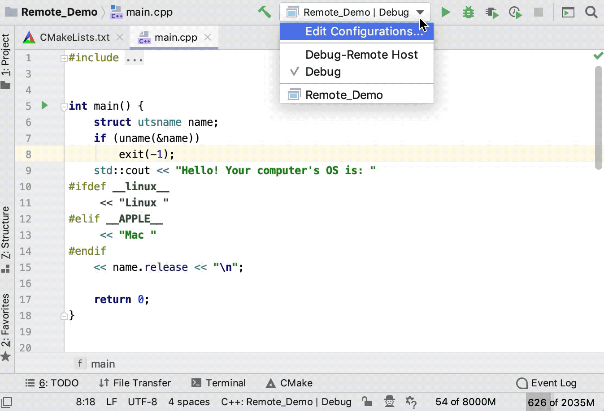

# IDE configuration

## Configure the IDE

1. Create a C++ Executable project. You can set the location and language standard of the new project.

   

2. Go to **File->Settings->Build,Execution,Deployment->Toolchains** and fill the corresponding locations.

   

   > [!Note]
   >
   > No red error indicates successful configuration.

3. Go to **Run->Edit Configurations**, click the **＋** button and create a **CMake Application**.

   

4. Go to **Run->Run 'Debug'** to run the program. If the output is the same as below, the configuration is successful.

   

## Remote development

### Create a toolchain with remote credentials

1. Go to **File|Settings| Build, Execution, Deployment | Toolchains** and select **Remote Host** from the list of toolchains or clickand select **Remote Host** from the drop-down menu to create a new toolchain.

2. Click  next to the **Credentials** field. In the dialog that opens, create an SSH configuration and  provide the credentials for accessing you remote machine. Existing SSH configurations are available from the drop-down list.

   

   > [!Tip]
   >
   > You can also manage SSH configurations in Settings / Preferences | Tools | SSH Configurations.

3. After establishing the connection, CLion attempts to detect the tools in default remote locations **/usr/bin/cmake** and **/usr/bin/gdb** (or using the full paths, if you have provided manually). When the  checks finish successfully, the toolchain is ready for use: 

   

4. You can make the newly created toolchain the **default** one (for this, move it to the top of the toolchains list by clicking ). When set as default, the remote toolchain is used for all the projects you create and open in CLion.               

   Note that if you set the remote toolchain as default, the **default CMake profile** will connect to it automatically, so you do not need  to configure a separate CMake profile for it.

### Create the corresponding CMake profile

> [!Note]
>
> Skip this procedure if your remote toolchain is [set as default](https://www.jetbrains.com/help/clion/remote-projects-support.html#RemoteAsDefault).         

+ Go to **Settings / Preferences | Build, Execution, Deployment | CMake**, click to create a new [CMake profile](https://www.jetbrains.com/help/clion/cmake-profile.html), and connect it to your remote toolchain using the **Toolchain** field: 

  

### Check and adjust the deployment configuration

+ When you create a connection entity for the remote toolchain, CLion puts it in the list of [server access configurations](https://www.jetbrains.com/help/clion/settings-deployment.html) in **Settings / Preferences | Build, Execution, Deployment | Deployment**. 

  CLion automatically configures the paths for your project code synchronization. Use the **Mappings** tab to change the default mappings (for example, to set a particular  remote directory for the copied sources instead of the default **tmp** folder):         

  

+  You can monitor the synchronization process in the **File Transfer** tool window (**View | Tool Windows | File Transfer**):             

  

  

### Resync header search paths

+ To resolve your code correctly, CLion synchronizes **header search paths** with all the content from the remote machine to the local client. *For example*, even though standard library headers are taken from the target, you can navigate to them as if you were working locally in the CLion editor.             

  However, header search paths synchronization can be  time-consuming, so CLion performs it automatically only upon the initial file transfer. After that, it is not triggered by CMake reloads. So  every time you switch the compiler or make changes in your project  dependencies, make sure to update header search paths manually by  calling **Tools | Resync with Remote Hosts**.             

  You can also switch to automatic synchronization: set the *clion.remote.resync.system.cache* key in the Registry (go to **Help | Find Action** or press `Ctrl+Shift+A`, type *Registry*, and search for the key by name).

### Build, run, debug

Now that you have a remote toolchain and the corresponding CMake profile configured, you can build, run, and debug your application and tests in the completely remote way by **selecting the proper CMake profile** in the Run/Debug configuration switcher:             

Also, you can use the [remote SSH terminal](https://www.jetbrains.com/help/clion/running-ssh-terminal.html) and run [remote external tools](https://www.jetbrains.com/help/clion/settings-tools-remote-ssh-external-tools.html) as a Before launch step of your Run/Debug configuration.         

Below you can find a demo showing how the application output  changes depending on the OS that it runs on. Having macOS as a  local system, we connect remotely to the Ubuntu target and check the OS  name. In this example, code highlighting depends on the OS  identifier, so when we switch the CMake profile or [resolve context](https://www.jetbrains.com/help/clion/switching-resolve-context.html), CLion highlights the corresponding code branch:

