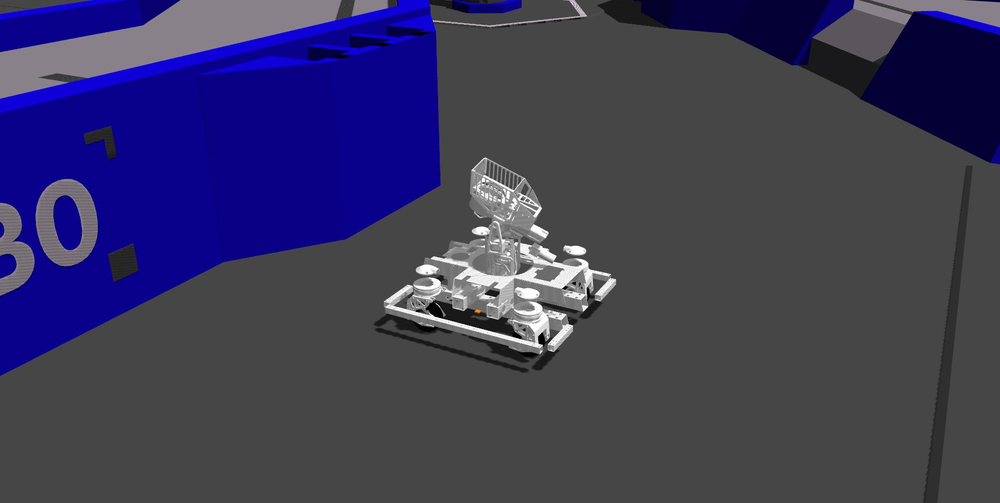
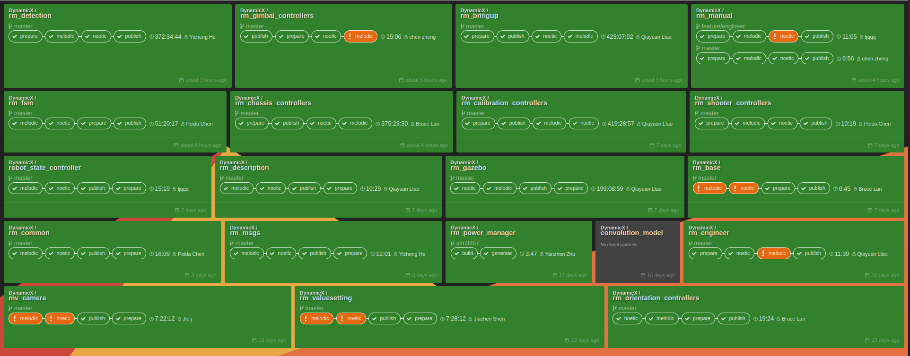
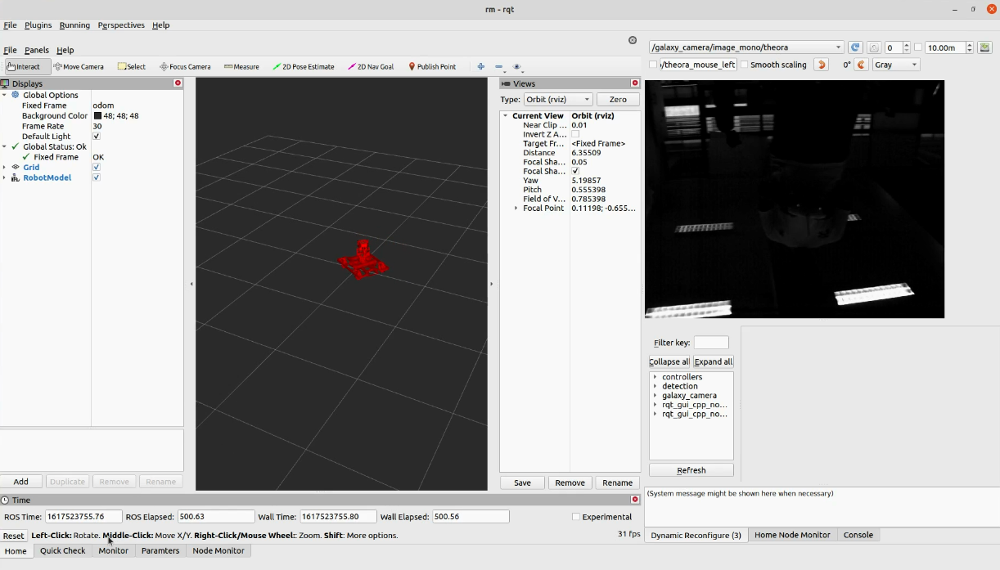

<h1 style="text-align:center">Why rm-controls？</h1>

rm-controls 是一套在 PC 上运行的无下位机电控软件，基于 [ros-controls](http://wiki.ros.org/ros_control) 的硬件和仿真接口以及配套的控制器，用于开发 RoboMaster 机器人和高性能机器人。

<!-- 1. 极其简单的系统结构
   * 不需要编写单片机程序
   * 主控与视觉识别的计算设备相同
2. 极高开发效率
   * 所有电机, 传感器数据均可记录和可视化
   * 所有控制参数均可动态和远程调试
   * 丰富的成熟软件包
3. 兼容性可复用性强
   * 提供三套硬件解决方案
   * 程序模块化, 并通过ROS plugins进行动态加载, 所有机器人共用一套代码
   * 支持 CAN 总线, DBus, UART, GPIO, PWM 等 RM 常用外设
4. 相比单片机而言, 极高的算力 -->

## 极高的代码复用率
我们在设计代码架构时，极其注重代码复用性，将代码模块化并参数化，对于不同机器人只需要根据配置文件加载不同数量和种类的控制器。做到了**一套**代码给**所有**机器人同时使用，如：在开发好步兵的基础模块后，开发双云台哨兵时，只需要编写配置`.yaml`文件 ，除了决策层的开发，不需要书写或修改任何一行代码。下图展示部署使用了这套代码的机器人

<!-- TODO(qiayuan) 6台机器人照片 -->

下面代码为哨兵的云台控制器部分配置文件，可以看到上下两个云台的配置文件结构相同，两个云台控制器被独立地动态地加载，然后分别获取两个控制器的参数，包括它要控制的关节名称，还有对外接口(以ros topic等形式)的名称。

```yaml
upper_gimbal_controller:
    type: rm_gimbal_controllers/Controller
    detection_topic: "/upper_detection"
    camera_topic: "/upper_camera/camera_info"
    yaw:
      joint: "upper_yaw_joint"
      pid: { p: 5.0, i: 0, d: 0.3, i_clamp_max: 0.0, i_clamp_min: -0.0, antiwindup: true}
    pitch:
      joint: "upper_pitch_joint"
      pid: { p: 8.0, i: 50, d: 0.3, i_clamp_max: 0.1, i_clamp_min: -0.1, antiwindup: true}
lower_gimbal_controller:
    type: rm_gimbal_controllers/Controller
    detection_topic: "/lower_detection"
    camera_topic: "/lower_camera/camera_info"
    yaw:
      joint: "lower_yaw_joint"
      pid: { p: 5.0, i: 0, d: 0.3, i_clamp_max: 0.0, i_clamp_min: -0.0, antiwindup: true}
    pitch:
      joint: "lower_pitch_joint"
      pid: { p: 5.0, i: 100, d: 0.2, i_clamp_max: 0.4, i_clamp_min: -0.4, antiwindup: true}
```
## 多刚体动力学仿真
所有机器人都能在 Gazebo 进行多刚体动力学仿真，且仿真和实车运行的代码不需要相互移植，是同一份代码甚至同一个二进制文件。除了发射控制器，其他模块和控制器在开发时均会在仿真中调试和测试，打断点时可以做到时间暂停，在机械组还没有加工装配好车时已经可以把代码测试好，完成参数的粗调，大大提高开发和迭代效率。如：舵轮机器人在加工装配好后只花不到一天时间就测试调试完所有程序。下图为舵轮机器人在 RMUC 场地中的仿真。



## 持续集成

我们在自建 gitlab 服务器上使用了 [industrial_ci](https://github.com/ros-industrial/industrial_ci) 对代码进行持续集成，自动对代码进行编译、测试并发布到 apt 源上，当在某台机器人上开发稳定之后，其他机器人可以使用安装或升级的方式获得最新功能的软件。如：使用两行指令完成底盘控制器的安装或更新。

```sh
sudo apt update
sudo apt install ros-noetic-rm-chassis-controllers
```

> [!Note]
>
> 由于在 GitHub上 开源，我们已经将大部分仓库转移至 GitHub 托管并使用 GitHub Actions 运行CI。

## 良好的兼容性
硬件接口使用了 Linux 的 [SocketCAN](https://www.kernel.org/doc/Documentation/networking/can.txt) 和 sysfs，意味着可以在 Jetson AGX 和妙算等带有CAN总线的 ARM 设备上运行，同时我们还制作了usb转CAN设备: [rm_usb2can](https://github.com/rm-controls/rm_usb2can)，从而支持在任意 x86 平台上面运行，如：Intel NUC和队员的笔记本电脑，在RMUC中我们以Intel NUC为主，也被官方在2021年高中生暑期营中部署在妙算2上使用。下图展示了兼容的部分计算设备。


## 丰富的调试工具
依托 ROS 生态，可以使用多种可视化调试工具，对电机数据，计算结果和图像远程查看。还可以使用 dynamic_reconfigure 进行动态调参。展示了我们搭建的调试界面，由 rqt 的支持，我们不需要编写代码就可以构建自己的调试图形界面。


